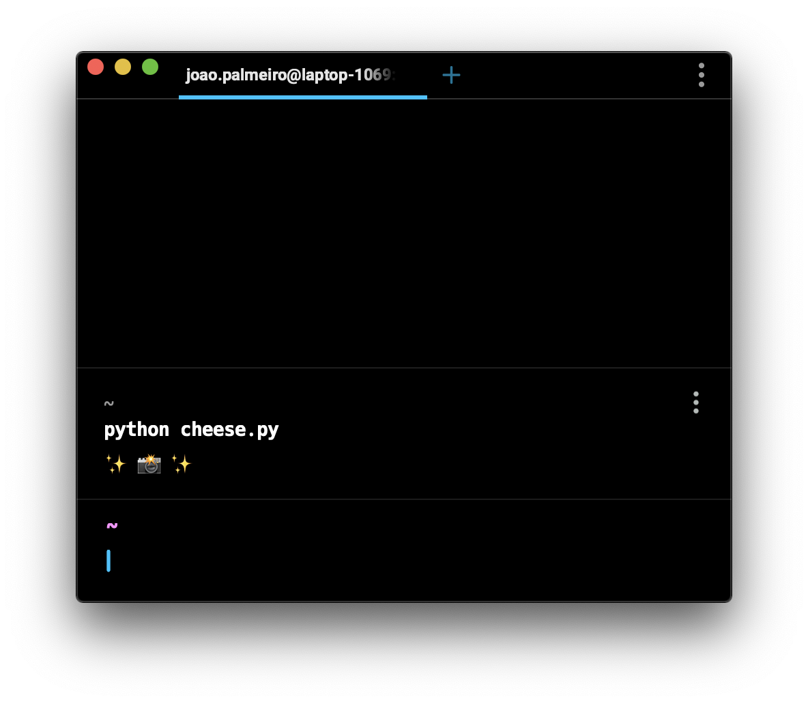
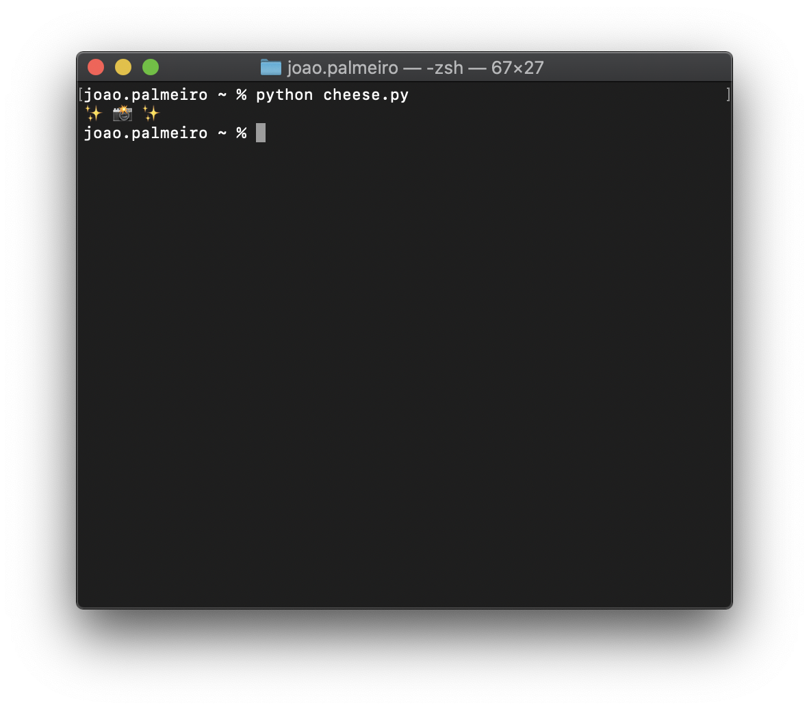

# Terminals

Metadata about different terminals.

| Terminal                                                                 | TERM           | TERM_PROGRAM   | TERM_PROGRAM_VERSION | OS            |
| ------------------------------------------------------------------------ | -------------- | -------------- | -------------------- | ------------- |
| [Warp](https://www.warp.dev/)                                            | xterm-256color | WarpTerminal   | -                    | macOS-10.15.7 |
| [Terminal (macOS)](https://support.apple.com/guide/terminal/welcome/mac) | xterm-256color | Apple_Terminal | 433                  | macOS-10.15.7 |

## Emoji support

### Warp

> Screenshot app: [Screenshot (macOS)](https://support.apple.com/en-gb/guide/mac-help/mh26782/10.15/mac/10.15)

### Terminal (macOS)

> Screenshot app: [Screenshot (macOS)](https://support.apple.com/en-gb/guide/mac-help/mh26782/10.15/mac/10.15)

## Development

- `pipenv install --python 3.8`.
- `pipenv shell`.
- Run this script via the desired terminal: `python script.py`.
- `python cheese.py`.

## Notes

- [is-unicode-supported](https://github.com/sindresorhus/is-unicode-supported).
- `TERM_PROGRAM`, `TERM_PROGRAM_VERSION`, and `TERM` environment variables.
- [Support TERM_PROGRAM environment variables](https://github.com/mintty/mintty/issues/776) issue.
- Table:
  - The `OS` column corresponds to the operating system where the script was run.
  - `-` represents the default value for _undefined_ environment variables.
- Hyper [themes](https://hyper.is/themes).
- Terminals or terminal emulators.
- Warp [issues](https://github.com/warpdotdev/warp/issues).
- [CleanShot X](https://cleanshot.com/) (available via [Setapp](https://setapp.com/apps/cleanshot))
- [ZSH: Hide computer name in terminal](https://stackoverflow.com/a/59944342). `sudo code /private/etc/zshrc` + `%n@%m` -> `%n` (`PS1`). It works for Terminal (macOS).
